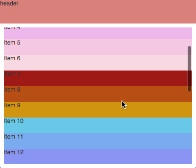

An experimental alternative to Graphics.Element and elm-html

The concept being explored by this rendering library is to have the core element
type be a function of `{x,y,w,h} -> rendering` instead of simply being a rendering.
This leads to some interesting properties with respect to creating dynamic layouts,
and thus far appears to give a nice API for quickly creating and modifying layouts.
It also provides a mechanism for creating reusable layout logic.

## Example

```elm
import Layout
import Window

view =
    Layout.top 48
        (Layout.placeholder "header")
        ( [1..25]
            |> List.map (\n -> "Item " ++ (toString n))
            |> List.map Layout.placeholder
            |> Layout.list 32
            |> Layout.inset 8
        )

main = Layout.toFullWindow (Signal.constant view)
```


